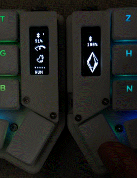
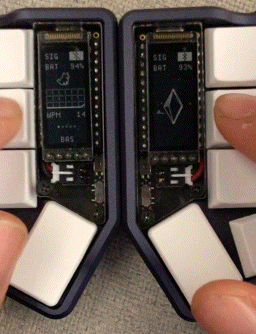
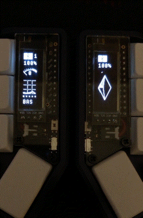
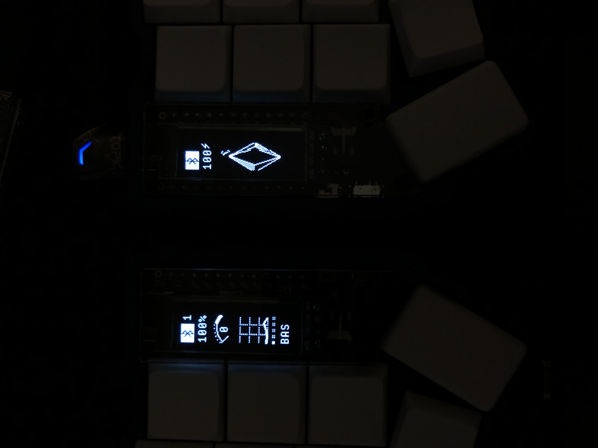
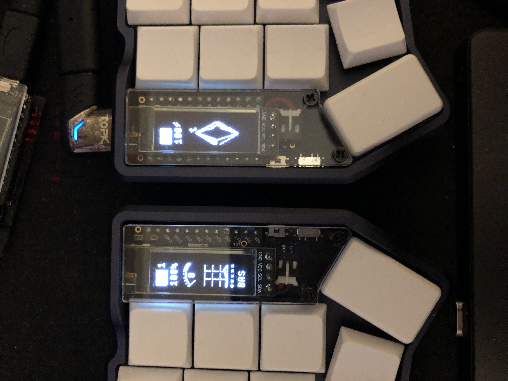
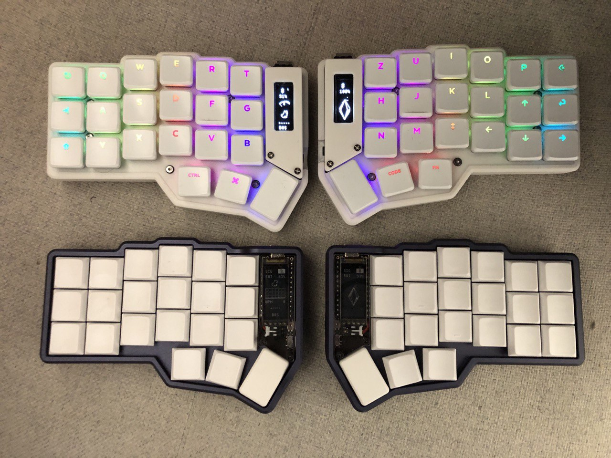
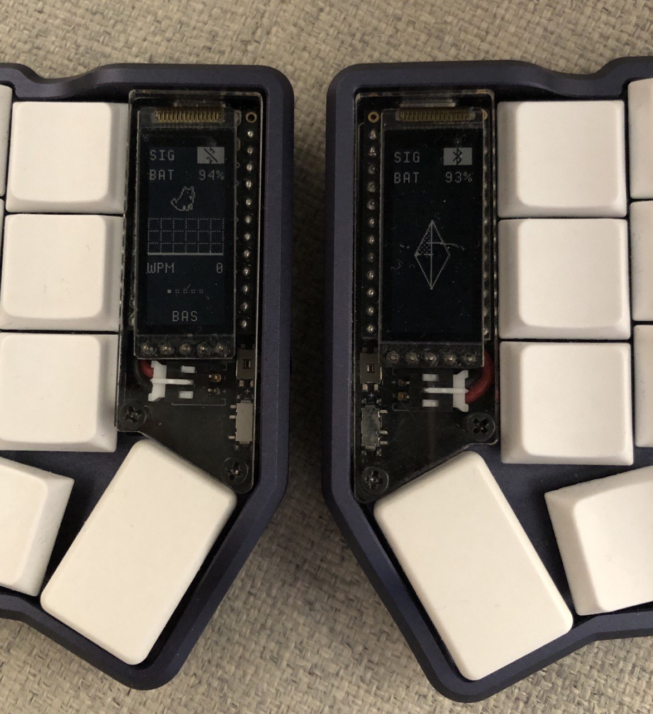
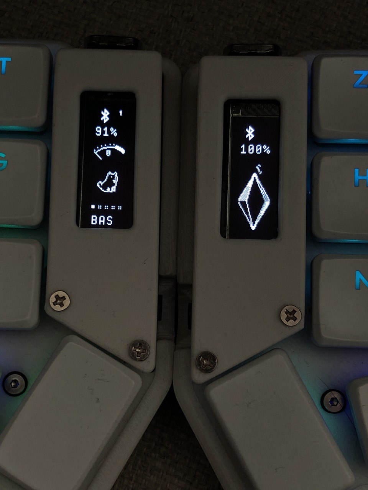
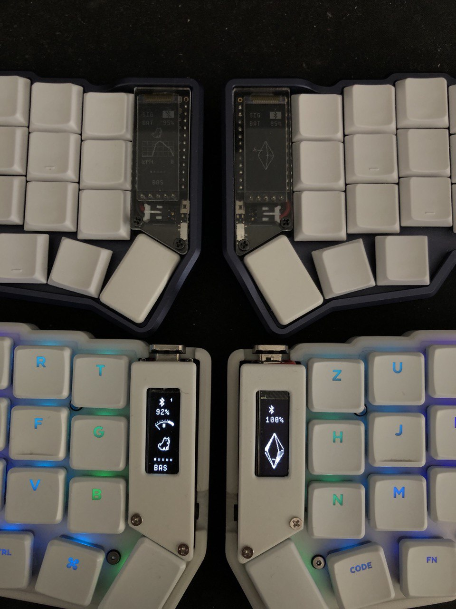

# nice!oled - nice!epaper




## Table of Contents

- [Overview](#overview)
- [Gallery](#gallery)
- [Quick Installation](#quick-installation)
- [Configuration](#configuration)
- [Suggestions](#suggestions)
- [Limitations](#limitations)
- [Inspiration & Credits](#inspiration)
- [Support](#if-you-like-my-contributions-please-dont-forget-the-following)

# Overview
- `nice_oled` vertical widgets for `oled` screens with zmk (for split and non-split keyboards)
- `nice_epaper` vertical widgets for `nice_view` screens with zmk (for split and non-split keyboards)


Shields supported:

- `nice_oled`
- `nice_epaper`

General characteristics:

- **Vertical layout**
- **Compact**
- **HID widget**
- **Modifiers widget**
- **vertical animations for central and periphery**
- **Prevents your neck from hurting when looking at the keyboard**
- **Easy to read in the dark** (`nice_oled`)

# Gallery










# Quick Installation
> [!TIP]
>
> All widgets are enabled `hid`,` modifiers`, `wpm` etc., if you want to
> disable them, look at the configuration section

Installation in 4 simple steps:

1. Make sure to enable the custom status screen in your `*.conf` file:

```conf
CONFIG_ZMK_DISPLAY=y
CONFIG_ZMK_DISPLAY_STATUS_SCREEN_CUSTOM=y
```

2. Copy and paste this into your `config/west.yml` file:

```yaml
manifest:
  remotes:
    - name: zmkfirmware
      url-base: https://github.com/zmkfirmware
    # support nice_oled and nice_epaper
    - name: mctechnology17
      url-base: https://github.com/mctechnology17
  projects:
    - name: zmk
      remote: zmkfirmware
      revision: main
      import: app/west.yml
    # support nice_oled and nice_epaper
    - name: zmk-nice-oled
      remote: mctechnology17
      revision: main
  self:
    path: config
```

3. In the `build.yaml` file, add the `nice_oled` shield (using the corne as an
   example, but it could be another shield).

For `oled` screen:
```yaml
---
include:
  - board: nice_nano_v2
    shield: corne_left nice_oled
  - board: nice_nano_v2
    shield: corne_right nice_oled
```

For `nice_view` screen:
```yaml
---
include:
  - board: nice_nano_v2
    shield: corne_left nice_view_adapter nice_epaper
  - board: nice_nano_v2
    shield: corne_right nice_view_adapter nice_epaper
```

4. Build the firmware, flash it to your keyboard, and enjoy!

# Configuration
> [!IMPORTANT]
> Make sure to enable the custom status screen in your ZMK configuration:

> [!TIP]
>
> 1. You can disable the gem animation if you find it annoying or want to save
>    battery life with the option `CONFIG_NICE_OLED_GEM_ANIMATION=n` in your `./config/corne.conf` file.
> 2. You can also deactivate it as follows `cmake-args:
>    -DCONFIG_NICE_OLED_GEM_ANIMATION=n` in your `build.yaml` file.
> 3. Remember that you can save battery by also turning off the screen and
>    activating deep sleep mode `CONFIG_ZMK_SLEEP=y
>    CONFIG_ZMK_IDLE_TIMEOUT=60000`. Here `60000` is the time in milliseconds,
>    in this case `1` minute `=` `(1*60*1000ms)`.

Make sure to enable the custom status screen in your ZMK configuration:

```conf
CONFIG_ZMK_DISPLAY=y
CONFIG_ZMK_DISPLAY_STATUS_SCREEN_CUSTOM=y
```

Modify the behavior of this shield by adjusting these options in your personal configuration files. For a more detailed explanation, refer to [Configuration in the ZMK documentation](https://zmk.dev/docs/config).

| Option                                     | Type | Description                                                                                                                                                                                                                                                       | Default |
| ------------------------------------------ | ---- | ----------------------------------------------------------------------------------------------------------------------------------------------------------------------------------------------------------------------------------------------------------------- | ------- |
| `CONFIG_NICE_OLED_GEM_ANIMATION_WPM_FIXED_RANGE`     | bool | This shield uses a fixed range for the chart and gauge deflection. If you set this option to `n`, it will switch to a dynamic range, like the default nice!view shield, which dynamically adjusts based on the last 10 WPM values provided by ZMK.                | y       |
| `CONFIG_NICE_OLED_GEM_ANIMATION_WPM_FIXED_RANGE_MAX` | int  | You can adjust the maximum value of the fixed range to align with your current goal.                                                                                                                                                                              | 100     |
| `CONFIG_NICE_OLED_GEM_ANIMATION`           | bool | If you find the animation distracting (or want to save on battery usage), you can turn it off by setting this option to `n`. It will instead pick a random frame of the animation every time you restart your keyboard.                                           | y       |
| `CONFIG_NICE_OLED_GEM_ANIMATION_MS`        | int  | Alternatively, you can slow down the animation. A high value, such as 96000, slows the animation considerably, showing the next frame every couple of seconds. The animation consists of 16 frames, and the default value of 960 milliseconds plays it at 60 fps. | 960     |
| `CONFIG_NICE_OLED_WIDGET_WPM`                                   | bool | Enables the Words Per Minute (WPM) widget on the OLED display.                                 | y       |
| `CONFIG_NICE_OLED_WIDGET_WPM_LUNA`                              | bool | Activates the Luna animation for the WPM widget.                                               | y       |
| `CONFIG_NICE_OLED_WIDGET_WPM_LUNA_ANIMATION_MS`                  | int  | Sets the duration of the Luna animation for the WPM widget (in milliseconds).                  | 300     |
| `CONFIG_NICE_OLED_WIDGET_HID_INDICATORS`                         | bool | Enables the Human Interface Device (HID) indicators widget.                                    | y       |
| `CONFIG_NICE_OLED_WIDGET_HID_INDICATORS_LUNA`                    | bool | Activates the Luna animation for the HID indicators widget.                                    | y       |
| `CONFIG_NICE_OLED_WIDGET_HID_INDICATORS_LUNA_ANIMATION_MS`       | int  | Sets the duration of the Luna animation for the HID indicators widget (in milliseconds).       | 300     |
| `CONFIG_NICE_OLED_WIDGET_MODIFIERS_INDICATORS`                   | bool | Enables the modifiers indicators widget, which shows active modifier keys.                     | y       |
| `CONFIG_NICE_OLED_WIDGET_MODIFIERS_INDICATORS_LUNA`              | bool | Activates the Luna animation for the modifiers indicators widget.                              | y       |
| `CONFIG_NICE_OLED_WIDGET_MODIFIERS_INDICATORS_LUNA_ANIMATION_MS` | int  | Sets the duration of the Luna animation for the modifiers indicators widget (in milliseconds). | 300     |


You can deactivate luna the dog as follows (default is activated):
```conf
CONFIG_NICE_OLED_WIDGET_WPM=n
CONFIG_NICE_OLED_WIDGET_WPM_LUNA=n
CONFIG_NICE_OLED_WIDGET_HID_INDICATORS=n
CONFIG_NICE_OLED_WIDGET_HID_INDICATORS_LUNA=n
CONFIG_NICE_OLED_WIDGET_MODIFIERS_INDICATORS=n
CONFIG_NICE_OLED_WIDGET_MODIFIERS_INDICATORS_LUNA=n
```

# Suggestions
If you have any implementation suggestion or something similar opens a
discussion

# Limitations
Due to the extensive use of animations and vertical conversions, the processor
is heavily taxed by the required computations. This has inspired me to adopt
techniques similar to those used in Super Nintendo games (as documented in the
NesDev Wiki) to achieve smoother performance.

# Inspiration
Inspired/forked by the work of @M165437 and @englmaxi . All credits for them
for the original design and implementation.

- [nice-view-gem](https://github.com/M165437/nice-view-gem) by @M165437
- [zmk-dongle-display](https://github.com/englmaxi/zmk-dongle-display.git) by @englmaxi
- [nice-view-battery](https://github.com/infely/nice-view-battery) by @infely

# If you like my contributions, please don't forget the following:

