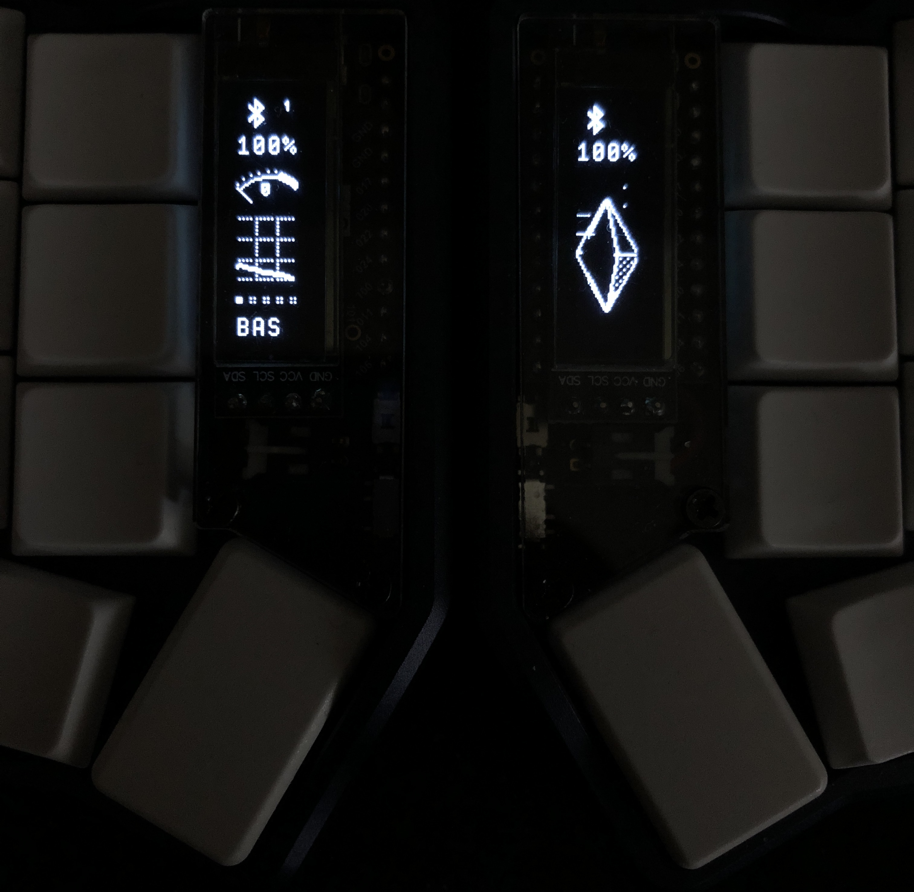

# nice!oled



nice_oled vertical widgets for oled screens with zmk (for split and non-split keyboards)

Inspired/forked by the work of @M165437 with his [nice-view-gem](https://github.com/M165437/nice-view-gem).
All credits to him for the original design and implementation.

Shields supported:
- nice_oled

The nice_oled is a ZMK module:
- **Vertical layout**
- **Compact**
- **Prevents your neck from hurting when looking at the keyboard**
- **Easy to read in the dark**

## Gallery


## Installation

Only small changes are needed to your keyboard configuration's build setup. Then, you'll need to rebuild and flash your keyboard firmware.

1. In the `config/west.yml` file, add a new remote and its related project.

```diff
manifest:
  remotes:
    - name: zmkfirmware
      url-base: https://github.com/zmkfirmware
+   - name: mctechnology17
+     url-base: https://github.com/mctechnology17
  projects:
    - name: zmk
      remote: zmkfirmware
      revision: main
      import: app/west.yml
+   - name: zmk-nice-oled
+     remote: mctechnology17
+     revision: main
  self:
    path: config
```

2. In the `build.yaml` file, add the `nice_oled` shield (using the corne as an
   example, but it could be another shield).

```diff
---
include:
  - board: nice_nano_v2
-   shield: corne_left
+   shield: corne_left nice_oled
  - board: nice_nano_v2
-   shield: corne_right
+   shield: corne_right nice_oled
```

3. Build the firmware, flash it to your keyboard, and enjoy!

# Configuration
> [!IMPORTANT]
> Make sure to enable the custom status screen in your ZMK configuration:

Make sure to enable the custom status screen in your ZMK configuration:

```conf
CONFIG_ZMK_DISPLAY=y
CONFIG_ZMK_DISPLAY_STATUS_SCREEN_CUSTOM=y
```

## Configuration

Modify the behavior of this shield by adjusting these options in your personal configuration files. For a more detailed explanation, refer to [Configuration in the ZMK documentation](https://zmk.dev/docs/config).

| Option                                     | Type | Description                                                                                                                                                                                                                                                       | Default |
| ------------------------------------------ | ---- | ----------------------------------------------------------------------------------------------------------------------------------------------------------------------------------------------------------------------------------------------------------------- | ------- |
| `CONFIG_NICE_OLED_GEM_WPM_FIXED_RANGE`     | bool | This shield uses a fixed range for the chart and gauge deflection. If you set this option to `n`, it will switch to a dynamic range, like the default nice!view shield, which dynamically adjusts based on the last 10 WPM values provided by ZMK.                | y       |
| `CONFIG_NICE_OLED_GEM_WPM_FIXED_RANGE_MAX` | int  | You can adjust the maximum value of the fixed range to align with your current goal.                                                                                                                                                                              | 100     |
| `CONFIG_NICE_OLED_GEM_ANIMATION`           | bool | If you find the animation distracting (or want to save on battery usage), you can turn it off by setting this option to `n`. It will instead pick a random frame of the animation every time you restart your keyboard.                                           | y       |
| `CONFIG_NICE_OLED_GEM_ANIMATION_MS`        | int  | Alternatively, you can slow down the animation. A high value, such as 96000, slows the animation considerably, showing the next frame every couple of seconds. The animation consists of 16 frames, and the default value of 960 milliseconds plays it at 60 fps. | 960     |

## Inspiration
- [nice-view-gem](https://github.com/M165437/nice-view-gem) by @M165437
- [nice-view-elemental](https://github.com/kevinpastor/nice-view-elemental) by @kevinpastor

# If you like my contributions, please don't forget the following:

